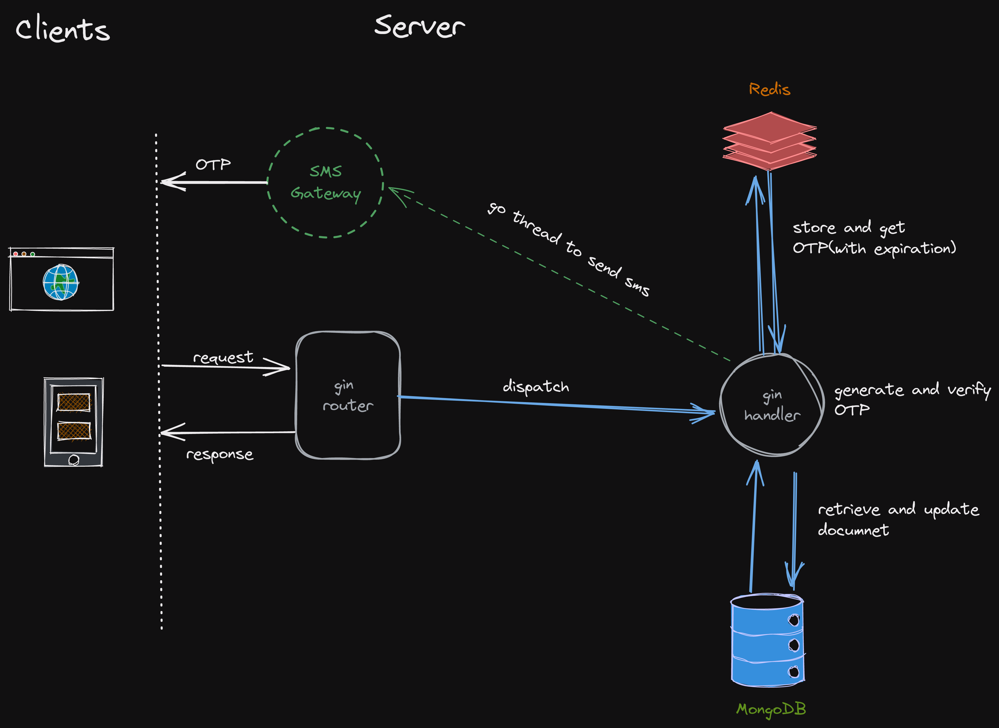

## Demo REST API project using Go-Gin

Demonstration of a **CURD** REST API using go-gin, mongodb and Redis. This project demonstrates the CURD applications for parcel courier delivery system, creating new parcel delivery, retriving parcels based on unique parcel id and dates, updating parcel delivery status with receiver OTP verification. 

## Architecture Overview



### Description

Go-gin router handles the http requests, dispatches the request to appropiate handlers that invokes the mongodb repository to create, retreive and update documents and returns the response as JSON object with proper http status code and error message(if any). A secondary Redis server is used to store the OTP for parcel receiver verification.

## API Endpoints

### Create New Parcel Order
Creating new parcel delivey order by given JSON object, a custom string to date object parser is used as gin default string to date parser works for only form data. curl request is as following

```shell
cURL --location --request POST 'http://0.0.0.0:8080/neworder' \
--header 'Content-Type: application/json' \
--data-raw '{
    "weight": 25.0,
    "status": "picked",
    "date_picked": "07-02-2021",
    "sender": {
        "name": "ABC",
        "phone": "+88017xxxxxxxx",
        "address": "Dhanmondi, Dhaka",
        "zip_code": "1209"
    },
    "receiver": {
        "name": "XYZ",
        "phone": "+88014xxxxxxxx",
        "address": "Notun Bazar, Barishal",
        "zip_code": "8200"
    }
}'
```

Response 

```json
{
    "_id": "62014e51cd62022b533ef466",
    "parcel_id": "2202070001",
    "weight": 25,
    "status": "picked",
    "date_picked": "07-02-2021",
    "sender": {
        "name": "ABC",
        "phone": "+88017xxxxxxxx",
        "address": "Dhanmondi, Dhaka",
        "zip_code": "1209"
    },
    "receiver": {
        "name": "XYZ",
        "phone": "+88014xxxxxxxx",
        "address": "Notun Bazar, Barishal",
        "zip_code": "8200"
    }
}
```

### Get All Parcel Orders

cURL Request format

```
curl --location --request GET 'http://0.0.0.0:8080/allorder'
```

Response: list of json objects

### Filtering Parcel orders by Date

cURL Request format

```
curl --location --request GET 'http://0.0.0.0:8080/parcel/date?date=07-02-2021'
```

Response

```json
[
    {
        "_id": "62014e51cd62022b533ef466",
        "parcel_id": "2202070001",
        "weight": 25,
        "status": "picked",
        "date_picked": "07-02-2021",
        "sender": {
            "name": "ABC",
            "phone": "+88017xxxxxxxx",
            "address": "Dhanmondi, Dhaka",
            "zip_code": "1209"
        },
        "receiver": {
            "name": "XYZ",
            "phone": "+88014xxxxxxxx",
            "address": "Notun Bazar, Barishal",
            "zip_code": "8200"
        }
    },
    {
        "_id": "6201505fcd62022b533ef467",
        "parcel_id": "2202070002",
        "weight": 30,
        "status": "picked",
        "date_picked": "07-02-2021",
        "sender": {
            "name": "ABC",
            "phone": "+88017xxxxxxxx",
            "address": "Dhanmondi, Dhaka",
            "zip_code": "1209"
        },
        "receiver": {
            "name": "XXX",
            "phone": "+88013xxxxxxxx",
            "address": "Sonadanga, Khulna",
            "zip_code": "9000"
        }
    },
    ...
    ...
]
```

### Get Parcel By Parcel ID

cURL request format (baseurl/parcel/<parcel_id>)

```
curl --location --request GET 'http://0.0.0.0:8080/parcel/2202070003'
```

### Verify Receiver
Generates OTP, stores the OTP in the Redis Server with expiry(5 Minutes) and send the OTP to receiver's phone number.

```
curl --location --request POST 'http://0.0.0.0:8080/parcel/2202070003/deliver'
```

**Http Response**

Status Code on Success **201** with following message

```json
{
    "message": "OTP created successfully"
}
```
### Verify OTP and Update
Verify the OTP and update parcel status if success.

```
curl --location --request POST 'http://0.0.0.0:8080/parcel/2202070003/verify' \
--header 'Content-Type: application/json' \
--data-raw '{
    "otp": "369358"
}'
```

**Http Response**

- Status Code **408** => OTP expired or wrong PID
- Status Code **401** => OTP does not match
- Status Code **202** => OTP matched and updated successfully
- Status Code **404** => No such parcel

Demo response on success
Document *status* changed to *delivered*

```json
{
    "_id": "6201505fcd62022b533ef467",
    "parcel_id": "2202070002",
    "weight": 30,
    "status": "delivered",
    "date_picked": "07-02-2021",
    "sender": {
        "name": "ABC",
        "phone": "+88017xxxxxxxx",
        "address": "Dhanmondi, Dhaka",
        "zip_code": "1209"
    },
    "receiver": {
        "name": "XXX",
        "phone": "+88013xxxxxxxx",
        "address": "Sonadanga, Khulna",
        "zip_code": "9000"
    }
}
```

### Custom Utilities

- String-Date custom marshal-unmarshal to support JSON format with gin.
- unique 10digit parcel id generator for parcels in mongodb(mongodb _id is a little bit long for human use)
- generating simple usage 6 digit OTP from the normal distribution of digits

### References

- [Go-Gin](https://github.com/gin-gonic/gin)
- mongodb driver for go [mongo](https://pkg.go.dev/go.mongodb.org/mongo-driver/mongo?utm_source=godoc)
- redis driver for go [go-redis](https://github.com/go-redis/redis/)
